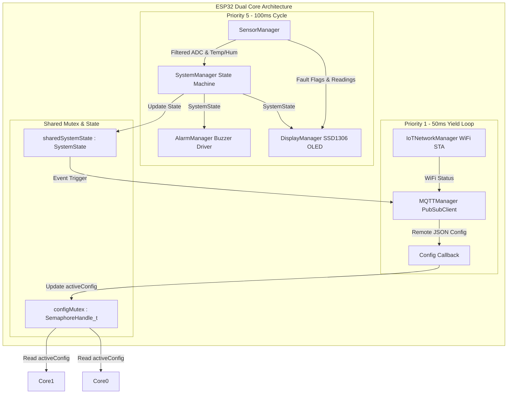
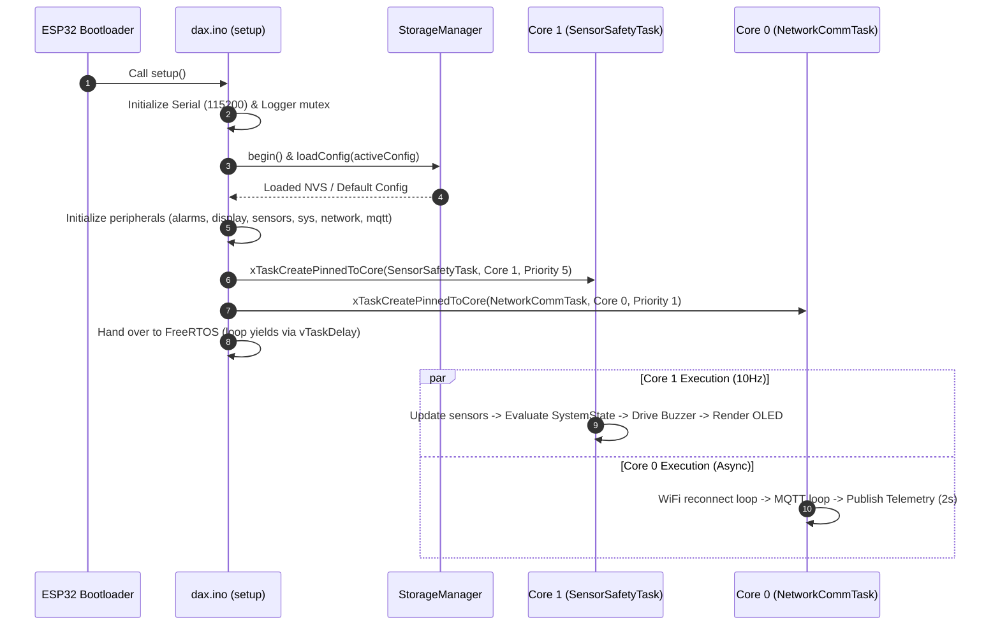

# Developer Guide & Engineering Specification

**Target Firmware**: Hazardous Gas Early Warning System (ESP32)  
**Authoritative Guide Version**: 2.0  
**Target Platform**: Espressif ESP32 Dual-Core (Xtensa 32-bit LX6)  

This guide serves as the definitive architecture handbook, coding standard, and extension reference for human developers and AI coding assistants (Cursor, Claude Code, Codex, Antigravity, etc.) maintaining or extending this repository.

---

## 1. Project Philosophy

### Core Mission
The system provides life-safety hazardous gas monitoring, early warning detection, and local/remote telemetry for industrial and residential environments.

### Architectural Principles
1. **Safety-First Decoupling**: Safety execution (sensor sampling, filtering, hazard detection, alarm generation, and local OLED feedback) is completely isolated from network communications. Loss of WiFi or MQTT connectivity **never** impairs or delays safety monitoring.
2. **Zero Dynamic Allocation on Hot Paths**: Hot loops (sampling at 10Hz, state evaluation, buzzer modulation, OLED rendering) must never perform heap allocations (`new`, `malloc`, dynamic `String` concatenation, `std::function` wrappers). All data structures and buffers are stack-allocated or static class members.
3. **Transport Independence**: The core safety engine (`SystemManager`) operates strictly on raw numeric values and boolean indicators. It contains zero references to hardware drivers, display libraries, or networking protocols.
4. **Deterministic Multi-Core FreeRTOS Execution**: Hardware safety operations are pinned to **Core 1** with high priority (5), while communication tasks are pinned to **Core 0** with low priority (1).

---

## 2. Architecture Overview

### System Architecture & Dual-Core Partitioning



### Directory Structure

```
hazardous-gas-early-warning-system/
├── dax.ino                  # Main entry point & FreeRTOS task creation
├── Config.h                 # Global constants, pin maps, state enum, DeviceConfig struct
├── Logger.h                 # Thread-safe variadic logging macros (LOGI, LOGW, LOGE, LOGD)
├── Filters.h                # DSP filters (MedianFilter, ExponentialMovingAverage)
├── AlarmManager.h/.cpp      # Non-blocking piezo buzzer pattern generator
├── DisplayManager.h/.cpp    # SSD1306 OLED UI renderer with I2C bus auto-recovery
├── NetworkManager.h/.cpp    # IoTNetworkManager WiFi STA backoff reconnection engine
├── MQTTManager.h/.cpp       # PubSubClient telemetry, LWT state, and remote config client
├── SensorManager.h/.cpp     # MQ-2, MQ-4, MQ-135, DHT22 acquisition & ADC diagnostics
├── StorageManager.h/.cpp    # NVS persistent configuration storage via ESP32 Preferences
├── SystemManager.h/.cpp     # Safety state engine, hysteresis, and Rate-of-Rise math
└── docs/
    └── DEVELOPER_GUIDE.md   # This document
```

### Execution & Boot Sequence



---

## 3. Module Responsibilities

### `Config` (`Config.h`)
- **Purpose**: Central system configuration namespace (`namespace Config`).
- **Responsibilities**: Defines hardware pin maps, OLED setup parameters, FreeRTOS cycle timings, reconnection backoff limits, thermal compensation coefficients, safety thresholds (`HYSTERESIS_VAL = 100`, `SAFE_MARGIN = 300`, `RATE_OF_RISE_THRESHOLD = 50.0f`), state text conversion (`getStateText`), and the `DeviceConfig` struct.
- **What it must never do**: Contain execution logic or mutable global variables (other than `extern` network default credential strings).

### `Logger` (`Logger.h`)
- **Purpose**: Thread-safe variadic logging utility.
- **Responsibilities**: Wraps `Serial.printf` with a FreeRTOS mutex (`m_mutex`). Exposes `LOGI`, `LOGW`, `LOGE`, `LOGD` macros. Formats lines with millisecond uptime tags (`[ms][LEVEL][TAG] msg`).
- **What it must never do**: Perform memory allocation or block for long durations inside log invocations.

### `SensorManager` (`SensorManager.h / .cpp`)
- **Purpose**: Physical sensor sampling and digital signal processing.
- **Responsibilities**:
  - Encapsulates hardware pins for MQ-2 (ADC 34), MQ-4 (ADC 35), MQ-135 (ADC 32), and DHT22 (GPIO 4).
  - Encapsulates member instance `DHT m_dht`.
  - Applies 3-sample `MedianFilter` followed by `ExponentialMovingAverage` (alpha = 0.2) to raw ADC readings.
  - Performs 10-second debounced ADC boundary diagnostics (`rawValue <= 5 || rawValue >= 4090`) to detect floating/shorted sensor pins.
  - Applies environmental compensation formula based on DHT22 temperature and humidity readings.
  - Tracks 5-minute (300,000ms) sensor element warm-up duration.
- **What it must never do**: Evaluate hazard safety states or trigger buzzer outputs directly.

### `SystemManager` (`SystemManager.h / .cpp`)
- **Purpose**: Safety hazard state engine.
- **Responsibilities**:
  - Evaluates filtered sensor values against configured thresholds with hysteresis latching.
  - Computes Rate-of-Rise (RoR) gas concentration spikes ($\ge 50.0$ units/sec).
  - Determines the current `SystemState` (`BOOT`, `HEATING`, `SAFE`, `NORMAL`, `MODERATE`, `WARNING`, `DANGER`, `CRITICAL`, `FAULT`).
  - Tracks state transition changes via `hasStateChanged()`.
- **What it must never do**: Read hardware ADC pins, toggle GPIOs, or access network sockets.

### `AlarmManager` (`AlarmManager.h / .cpp`)
- **Purpose**: Non-blocking audio warning pattern driver.
- **Responsibilities**:
  - Controls active piezo buzzer (GPIO 26).
  - Drives non-blocking tone patterns: Continuous ON (`DANGER`/`CRITICAL`), 200ms ON / 800ms OFF (`WARNING`), 100ms ON / 2500ms OFF (`FAULT`/`MODERATE`), OFF (`SAFE`/`NORMAL`/`HEATING`/`BOOT`).
  - Implements manual alarm silence logic via `silence()`.
- **What it must never do**: Use blocking `delay()` calls to generate warning patterns.

### `DisplayManager` (`DisplayManager.h / .cpp`)
- **Purpose**: Local visual diagnostics rendering on 128x64 SSD1306 OLED via I2C.
- **Responsibilities**:
  - Renders Boot, Heating progress, Monitor values, Network diagnostics, and Fault screens.
  - Rotates between Monitor and Network pages on a non-blocking timer.
  - Monitors I2C bus health every 5 seconds (`verifyI2CBus`) and executes bus reset (`recoverI2CBus`) upon bus lockup.
  - Uses `DisplaySnapshot` struct comparison to skip screen redraws when UI content remains identical.
- **What it must never do**: Block Core 1 execution or perform string comparison diffing per frame.

### `IoTNetworkManager` (`NetworkManager.h / .cpp`)
- **Purpose**: WiFi station (STA) mode connection and reconnection state machine.
- **Responsibilities**:
  - Configures `WiFi.mode(WIFI_STA)` and `WiFi.setAutoReconnect(true)`.
  - Executes non-blocking exponential backoff reconnection (doubling retry interval from 2s up to 60s max).
- **What it must never do**: Block execution during WiFi disconnection or run on Core 1.

### `MQTTManager` (`MQTTManager.h / .cpp`)
- **Purpose**: Remote MQTT telemetry, status publishing, and remote configuration callback subscriber.
- **Responsibilities**:
  - Connects to MQTT broker (`broker.emqx.io:1883`) with Last Will and Testament (LWT) set to `FAULT` on topic `<namespace>/gas/state`.
  - Subscribes to `<namespace>/gas/config` at QoS 1.
  - Uses `StaticJsonDocument` stack buffers to serialize telemetry JSON on `<namespace>/gas/data` and configuration ACK payloads on `<namespace>/gas/config/ack`.
  - Invokes `ConfigCallback` (`void (*)(const Config::DeviceConfig&)`) upon receiving valid JSON config updates.
- **What it must never do**: Use dynamic memory allocations (`DynamicJsonDocument`), `std::function`, or block sensor execution paths.

### `StorageManager` (`StorageManager.h / .cpp`)
- **Purpose**: Non-Volatile Storage (NVS) configuration reader and writer.
- **Responsibilities**:
  - Encapsulates ESP32 `Preferences` under namespace `gascfg`.
  - Persists and restores `DeviceConfig` fields (`mq2_en`, `mq2_on`, `mq2_off`, `mq4_en`, `mq4_on`, `mq4_off`, `mq135_en`, `mq135_on`, `mq135_off`, `dht_en`, `temp_warn`, `buzzer_en`).
  - Fallbacks to factory default configuration if NVS read fails.
- **What it must never do**: Leave NVS handles open across execution frames.

---

## 4. Development Workflow

Follow this strict step-by-step workflow for all modifications:

```
1. Understand Architecture & Boundaries
   ↓
2. Locate Affected Modules
   ↓
3. Design Interface / Logic Modifications
   ↓
4. Implement Changes (Preserving Memory & Safety Rules)
   ↓
5. Local Compilation Verification (arduino-cli compile)
   ↓
6. Static & Warning Inspection (--warnings all)
   ↓
7. Hardware / Emulator Verification
   ↓
8. Update Documentation (README, ARCHITECTURE, DEVELOPER_GUIDE)
   ↓
9. Commit & Push
```

Never skip steps or bypass verification.

---

## 5. Coding Standards

### Naming Conventions
- **Classes**: `CamelCase` (e.g., `SensorManager`, `IoTNetworkManager`).
- **Member Variables**: Prefix with `m_` (e.g., `m_buzzerState`, `m_lastDraw`).
- **Global Constants**: `UPPER_SNAKE_CASE` inside `namespace Config` (e.g., `HEATING_DURATION_MS`).
- **Local Variables**: `camelCase` (e.g., `localConfig`, `timeStr`).

### Formatting & Header Layout
- Use 4 spaces for indentation (no hard tabs).
- Include standard `#pragma once` guard at the top of every header file.
- Header order: Standard/System headers first (`<Arduino.h>`, `<freertos/FreeRTOS.h>`), followed by third-party library headers (`<Adafruit_SSD1306.h>`), followed by project headers (`"Config.h"`).

### Memory & Type Rules
- **No Dynamic Allocations**: Prohibit `new`, `delete`, `malloc`, `free`, and `std::string`.
- **Const Correctness**: Mark read-only methods `const` (e.g., `bool isConnected() const;`). Pass complex structures by `const` reference (`const Config::DeviceConfig& config`).
- **Use `constexpr`**: Prefer `constexpr` over `#define` for numeric constants.

---

## 6. Embedded Best Practices

### Memory & Stack Management
- **FreeRTOS Stack Allocations**:
  - `SensorSafetyTask` (Core 1): Stack size `4096` bytes.
  - `NetworkCommTask` (Core 0): Stack size `4096` bytes.
- Keep stack-allocated arrays small (e.g., `char buffer[128]`). For larger JSON documents (e.g. `StaticJsonDocument<1024>`), ensure task stack headroom is verified.

### FreeRTOS Concurrency Rules
- **Task Delay**: Use `vTaskDelayUntil()` for strict periodic execution on Core 1 (`SENSOR_READ_INTERVAL_MS = 100ms`). Use `vTaskDelay(pdMS_TO_TICKS(50))` on Core 0 to yield execution to the system watchdog.
- **Mutex Guarding**: Protect `activeConfig` modifications using `xSemaphoreTake(configMutex, pdMS_TO_TICKS(10))` and give the mutex back immediately. Do not hold mutexes across blocking I/O calls.

---

## 7. Safety Rules

The following algorithms and parameters are **safety-critical** and must **never** be altered without explicit authorization:

1. **Hazard Threshold Logic & Hysteresis**:
   - `HYSTERESIS_VAL = 100`: Prevents relay chatter and state oscillation near threshold boundaries.
   - `SAFE_MARGIN = 300`: Ensures sensor values drop safely below warning thresholds before returning to the `SAFE` state.
2. **Rate of Rise (RoR) Calculation**:
   - `RATE_OF_RISE_THRESHOLD = 50.0f` units/sec: Captures fast-rising gas leaks before absolute threshold breach.
3. **Sensor Element Pre-Heating**:
   - `HEATING_DURATION_MS = 300000UL` (5 minutes): Prevents false alarms during metal-oxide sensor element warm-up.
4. **Alarm Priority Hierarchy**:
   - `CRITICAL` > `DANGER` > `WARNING` > `MODERATE` > `SAFE` / `NORMAL`. High-danger states must always override silence locks when transitioning into a higher alert level.

---

## 8. Extension Guide

### Adding a New Gas Sensor (e.g., MQ-7 for Carbon Monoxide)

1. **`Config.h`**:
   - Add hardware pin map: `constexpr uint8_t PIN_MQ7 = 33;`
   - Add config fields to `DeviceConfig`: `bool mq7Enabled; int mq7On; int mq7Off;`
2. **`SensorManager.h / .cpp`**:
   - Add raw & filtered variables (`m_mq7Raw`, `m_mq7Filtered`, `m_mq7Median`, `m_mq7Ema`).
   - Read pin inside `readMQSensors()`, diagnose bounds inside `diagnoseFaults()`, apply compensation inside `compensateReadings()`.
3. **`SystemManager.h / .cpp`**:
   - Add warning and danger latches (`m_mq7WarningLatch`, `m_mq7DangerLatch`).
   - Incorporate into threshold evaluation and danger count inside `evaluate()`.
4. **`StorageManager.cpp`**:
   - Add NVS keys `mq7_en`, `mq7_on`, `mq7_off` in `loadConfig()` and `saveConfig()`.
5. **`MQTTManager.cpp`**:
   - Map `"mq7"` key into `publishTelemetry()` and `publishConfigAck()`.

---

## 9. Dependency Rules

### Allowed Dependencies
- `SensorManager` $\rightarrow$ `Config`, `Logger`, `Filters`, `DHT`
- `SystemManager` $\rightarrow$ `Config`, `Logger`
- `AlarmManager` $\rightarrow$ `Config`, `Logger`
- `DisplayManager` $\rightarrow$ `Config`, `Logger`, `Adafruit_SSD1306`, `Wire`
- `IoTNetworkManager` $\rightarrow$ `Config`, `Logger`, `WiFi`
- `MQTTManager` $\rightarrow$ `Config`, `Logger`, `WiFiClient`, `PubSubClient`, `ArduinoJson`
- `StorageManager` $\rightarrow$ `Config`, `Logger`, `Preferences`

### Forbidden Dependencies
- **`SensorManager` / `SystemManager` / `AlarmManager` MUST NOT depend on `WiFi`, `PubSubClient`, or `IoTNetworkManager`**.
- **`SystemManager` MUST NOT depend on `Adafruit_SSD1306` or `DHT`**.

---

## 10. AI Development Rules

AI assistants modifying this repository must obey the following operational constraints:

1. **Inspect Before Mutating**: Inspect whole target files using `view_file` before making edits.
2. **Preserve Compatibility**: Maintain 100% backward compatibility for all API parameters, NVS preference keys (`mq2_en`, `mq2_on`, etc.), and MQTT topic payload keys.
3. **No Name Collisions**: Do not rename `IoTNetworkManager` to `NetworkManager` as it collides with Espressif's built-in `NetworkManager` class in ESP32 Core v3.x.
4. **No Artificial Dependencies**: Do not introduce `std::function`, exceptions, or dynamic memory allocations on loop execution paths.
5. **Mandatory Compile Verification**: Always compile the project via `arduino-cli compile -b esp32:esp32:esp32` after edits to verify zero errors and zero warnings.

---

## 11. Common Pitfalls

- **Renaming `IoTNetworkManager` to `NetworkManager`**: Collides with Espressif's system class on ESP32 Core 3.x.
- **Float Comparison in Display Cache**: Comparing raw floats (`temp == o.temp`) causes float jitter redraws. Truncate floats to integer tenths before diffing.
- **Using `DynamicJsonDocument`**: Causes heap fragmentation. Always use `StaticJsonDocument` stack buffers.
- **Calling blocking `delay()` on Core 1**: Starves sensor acquisition and OLED rendering. Use `vTaskDelayUntil()`.

---

## 12. Validation Checklist

Before submitting PRs or finalizing commits, verify:

- [ ] Project compiles cleanly via `arduino-cli compile -b esp32:esp32:esp32 --warnings all`.
- [ ] 0 Compiler Errors, 0 Warnings.
- [ ] NVS preference key names match existing stored keys (`mq2_en`, `mq2_on`, etc.).
- [ ] MQTT topic schemas (`<namespace>/gas/data`, `<namespace>/gas/state`) remain unmodified.
- [ ] RAM and Flash footprint remain within acceptable parameters.
- [ ] All safety rules and hysteresis calculations are preserved.

---

## 13. Future Roadmap

Future hardware expansions must follow the established architecture:
- **Relay Actuators**: Add an `ActuatorManager` module on Core 1 driven by `SystemState`.
- **LoRa / GSM Transport**: Add a `LoRaManager` or `GSMManager` module on Core 0 reading `sharedSystemState` without touching Core 1 safety tasks.
- **OTA Updates**: Handle network OTA firmware flashing inside Core 0 communication tasks.

---

## 14. Non-Negotiable Repository Rules

1. Core 1 safety tasks must remain completely independent of Core 0 networking.
2. Zero dynamic heap allocations in hot paths.
3. NVS key schemas and MQTT telemetry formats must remain 100% backward-compatible.
4. All code must compile warning-free on standard ESP32 board packages.
